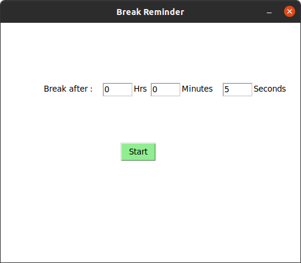
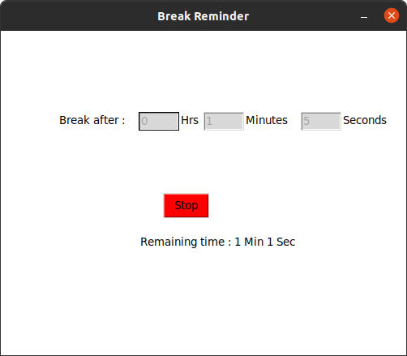
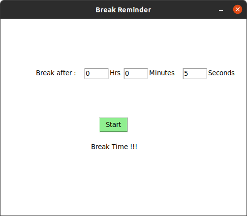

<p align="center">
 
</p>

<h3 align="center">Break Reminder</h3>

---

## 📝 Table of Contents

- [About](#about)
- [Features](feature)
- [Getting Started](#getting_started)
- [Built Using](#built_using)
- [Motive](#motive)
- [Sample images](#images)

## 🧐 About <a name = "about"></a>

A simple python GUI script that reminds you to take frequent Breaks while development.

## Features <a name = "feature"></a>

After timer completes

  - Play sound to notify user
  - Move app window to top of other windows
  - Shows message ```"Break Time !!!"```

## 🏁 Getting Started <a name = "getting_started"></a>

- requirements
  - [Python3](https://www.python.org/)
  - [tkinter](https://docs.python.org/3/library/tkinter.html)

- clone project
  ```
  git clone https://github.com/novicexp/break-reminder-tk-python
  ```
  ```
  cd break-reminder-tk-python/
  ```
- install requirements
  ```
  pip install -r requirements.txt
  ```
- run scripy 🤖
  ```
  python3 app.py
  ```

## ⛏️ Built Using <a name = "built_using"></a>

- [Python3](https://www.python.org/)
- [tkinter](https://docs.python.org/3/library/tkinter.html)

## 🤔 Motive <a name = "motive"></a>

I spend most of my day in front of my 🧑🏻‍💻. So, i have to sit at one place for too long hours. And it's not good for my health (I'm feeling it 😒).

So, i need something/someone to remind me frequently that i need to take short breaks after some interval of time (for stretching or for refreshment).

So, i developed this script.

Hope it will help you too 🥰

## 🪄 Sample Images <a name = "images"></a>

<p align="center">
 

 

 
</p>

## 💻 System

Successfully tested on

- Ubuntu 20.04 LTS
  - Python 3.8.5

The GUI is so simple (because i am using Tkinter first time 😅) and it should be 😎.